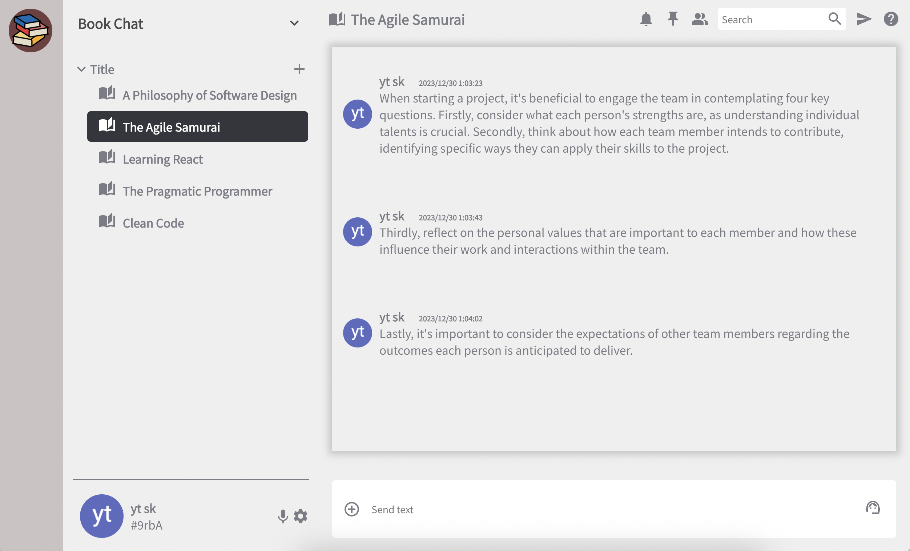

### Overview

**Book Chat**

This is a chat-style application designed for jotting down thoughts and learnings while reading books. It offers a seamless way to capture and organize insights gained during your reading sessions.

Note: This is a demo application created for learning purposes.Please do not deploy this to production.

<!--  -->

---

### System Architecture

#### Frontend

- React (TypeScript)
- Redux Toolkit

#### Backend

- Firebase
  - Cloud Firestore
  - Authentication

### npm start

- Runs the app in development mode.\
  Open [http://localhost:3000](http://localhost:3000) to view it in your browser.

### Features

- Login with Google Account
- Adding book spaces
- Posting notes

### Upcoming Features

- Integration of ChatGPT for enhanced note summarization and suggestions.
- Implementation of customizable dummy icons.
- Search functionality
